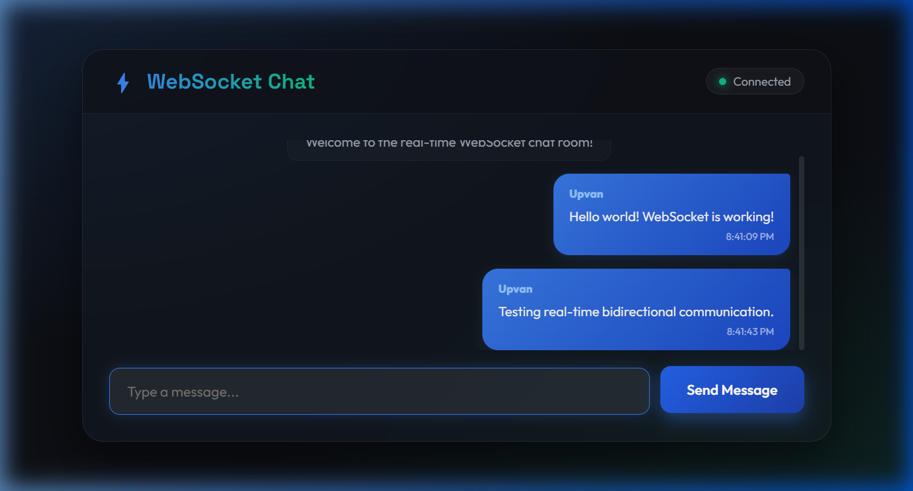
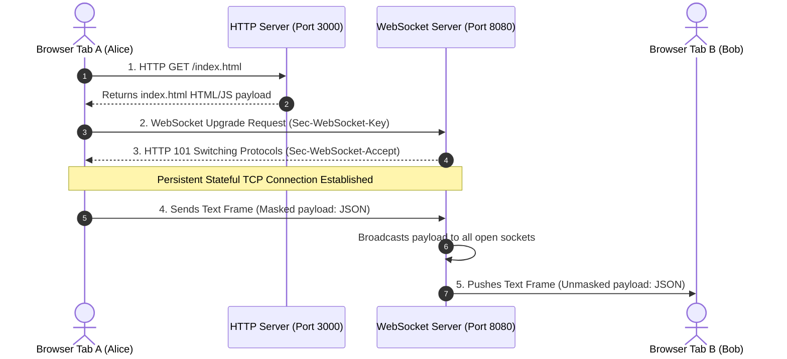

# WebSocket Real-Time Chat Room Demo

This project is a hands-on, practical demonstration of how the stateful **WebSocket Protocol (RFC 6455)** operates. It consists of a lightweight Node.js server and a modern glassmorphic HTML5 client, illustrating real-time bidirectional message framing.

---

## Application Preview



---

## 1. How It Works (System Architecture)

### ASCII Block Diagram
```
  [ Client Browser Tab A ]                      [ Client Browser Tab B ]
       |                                             |
       | 1. HTTP GET / (Port 3000)                   | 1. HTTP GET / (Port 3000)
       v                                             v
+--------------------------+                  +--------------------------+
|  Node.js HTTP Server     |                  |  Node.js HTTP Server     |
|  (Serves index.html)     |                  |  (Serves index.html)     |
+--------------------------+                  +--------------------------+
       |                                             |
       | 2. Handshake: WS Upgrade                    | 2. Handshake: WS Upgrade
       |    ws://localhost:8080                      |    ws://localhost:8080
       v                                             v
+------------------------------------------------------------------------+
|                      Node.js WebSocket Server                          |
|                      (Running on Port 8080)                           |
+------------------------------------------------------------------------+
       |                                             |
       | 3. Raw TCP Frame (Sent)                     | 3. Raw TCP Frame (Received)
       |    Payload: {"message": "Hello"}            |    Payload: {"message": "Hello"}
       +------------> [ Active Clients Set ] --------+
                      - Client Socket A (Open)
                      - Client Socket B (Open)
```

### Mermaid Sequence Diagram


---

## 2. Protocol Details

### The Handshake Headers
The connection starts as a standard HTTP request and is upgraded to a WebSocket:

#### 1. Client Handshake Request:
```http
GET / HTTP/1.1
Host: localhost:8080
Upgrade: websocket
Connection: Upgrade
Sec-WebSocket-Key: dGhlIHNhbXBsZSBub25jZQ==
Sec-WebSocket-Version: 13
```

#### 2. Server Handshake Response (101 Switching Protocols):
```http
HTTP/1.1 101 Switching Protocols
Upgrade: websocket
Connection: Upgrade
Sec-WebSocket-Accept: s3pPLMBiTxaQ9kYGzzhZRbK+xOo=
```

#### 3. How `Sec-WebSocket-Accept` is Computed:
1. Concatenate the client key `dGhlIHNhbXBsZSBub25jZQ==` with the magic GUID: `"258EAFA5-E914-47DA-95CA-C5AB0DC85B11"`.
2. Compute the **SHA-1 hash** of the result.
3. Encode the hash bytes in **Base64** to produce the accept signature.

---

## 3. Project Directory Structure
```
websocket_demo/
├── package.json      # Project dependencies (ws library)
├── server.js         # HTTP static server + WebSocket connection manager
├── index.html        # Glassmorphic chat client UI
└── README.md         # Architecture documentation
```

---

## 4. Run and Test Locally

### Prerequisites
Make sure you have Node.js installed (`node -v`).

### Step 1: Install Dependencies
Open your terminal in the `websocket_demo` directory and run:
```bash
cmd /c npm install
```

### Step 2: Start the Server
Start the servers by running:
```bash
node server.js
```
*You will see the following confirmation logs:*
```
HTTP Client Page server running at http://localhost:3000/
WebSocket Server running at ws://localhost:8080/
```

### Step 3: Test Real-Time Communication
1. Open your browser and navigate to **[http://localhost:3000/](http://localhost:3000/)**.
2. Enter a username (e.g., `Alice`) and click **"Connect to Chat"**.
3. Open a **second tab or private browsing window** at **[http://localhost:3000/](http://localhost:3000/)**.
4. Enter a different username (e.g., `Bob`) and connect.
5. Send messages between the tabs and watch them synchronize in real-time.
